## Objetivo del Tema

- **Comprender** el papel de **MicroPython como plataforma para el desarrollo de sistemas embebidos modernos**, identificar su relación con IoT y configurar el entorno de trabajo sobre ESP32 para el desarrollo de aplicaciones embebidas.

### 1. Sistemas Embebidos e IoT
Los **sistemas embebidos** y el **Internet de las Cosas (IoT)** son ==conceptos estrechamente vinculados en el desarrollo tecnológico actual== , donde los primeros actúan como la base fundamental que permite la existencia del segundo.

#### 1.1 Evolución de los Sistemas Embebidos

Los sistemas embebidos han evolucionado desde dispositivos diseñados para realizar una función específica de manera aislada, hasta convertirse en componentes fundamentales de arquitecturas distribuidas capaces de comunicarse, intercambiar información y participar en procesos de toma de decisiones.

Esta evolución ha dado origen a conceptos como Internet de las Cosas (IoT), Edge Computing y Sistemas Ciberfísicos (CPS), ampliamente utilizados en aplicaciones industriales, agrícolas, médicas y de automatización.

##### 1.1.1 Sistemas Embebidos Tradicionales

De acuerdo con Marwedel (2021), un sistema embebido es un sistema computacional integrado dentro de un sistema mayor y diseñado para realizar funciones específicas.

###### Características

* Función específica.
* Recursos limitados.
* Operación autónoma.
* Generalmente sin conectividad externa.

###### Ejemplos

* Controlador de una lavadora.
* Sistema ABS de un automóvil.
* Controlador de microondas.
* Termostato electrónico.

###### Arquitectura típica

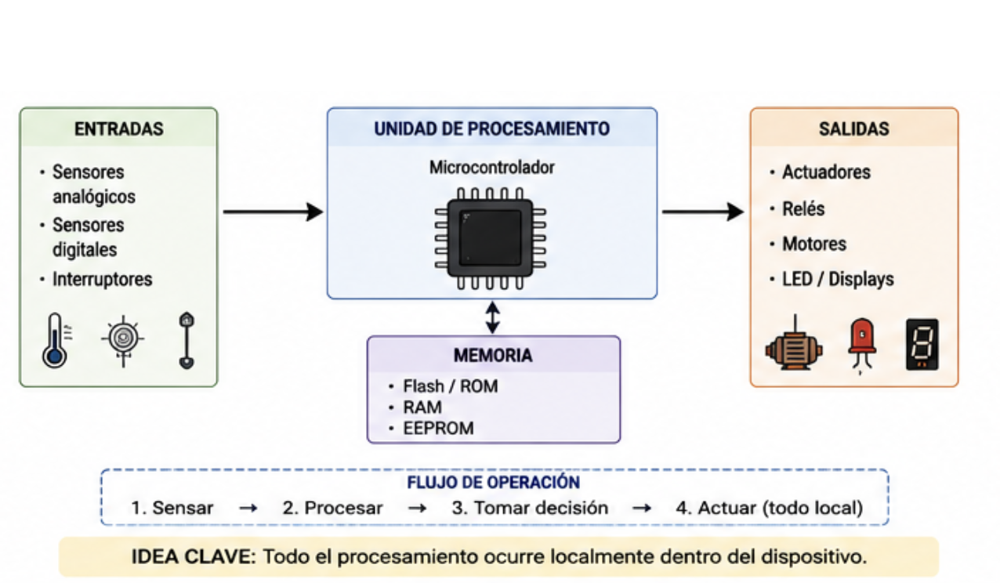{ width="600px" style="display:block;margin:auto" }

##### 1.1.2 Sistemas Embebidos Conectados

La incorporación de interfaces de comunicación permitió que los sistemas embebidos intercambiaran información con otros dispositivos.

###### Tecnologías comunes

* UART
* SPI
* I2C
* CAN Bus
* Modbus

###### Características

* Comunicación local.
* Intercambio de datos.
* Supervisión externa.

###### Ejemplos

* PLCs conectados mediante Modbus.
* Redes CAN en vehículos.
* Sistemas SCADA.

###### Arquitectura típica

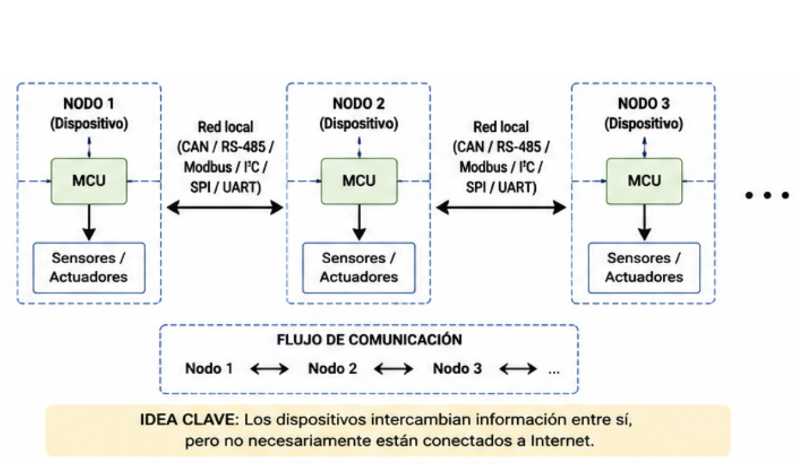{ width="600px" style="display:block;margin:auto" }

##### 1.1.3 Internet de las Cosas (IoT)

Según Bahga y Madisetti, IoT puede definirse como una red de objetos físicos capaces de adquirir información, comunicarse e intercambiar datos a través de Internet.

###### Características

* Conectividad IP.
* Monitoreo remoto.
* Interoperabilidad.
* Integración con plataformas en la nube.

###### Ejemplos

* Sensores ambientales conectados.
* Medidores inteligentes.
* Agricultura inteligente.
* Domótica.

###### Arquitectura típica
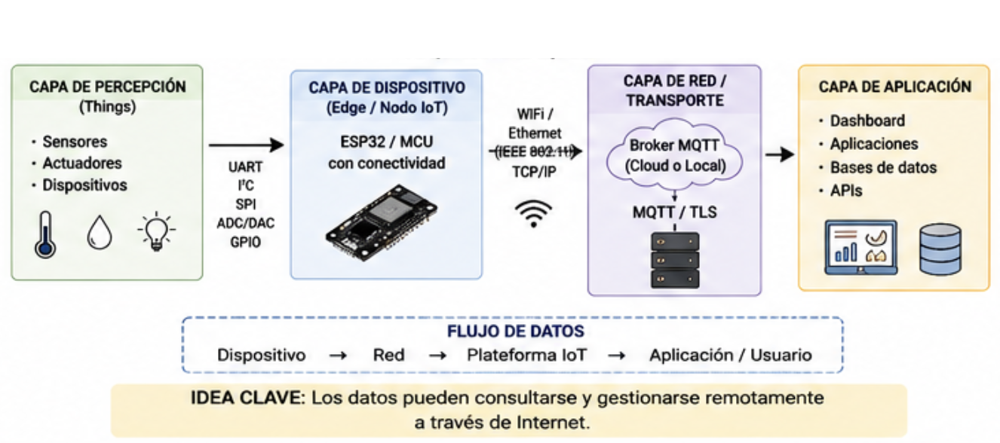{ width="600px" style="display:block;margin:auto" }

##### 1.1.4 Convergencia OT/IT

Tradicionalmente, los sistemas industriales y de automatización operaban en entornos separados de los sistemas informáticos empresariales.

Por un lado, las **Tecnologías de Operación (Operational Technology, OT)** se encargaban de monitorear y controlar procesos físicos mediante sensores, actuadores, PLCs, sistemas SCADA y redes industriales. Su principal objetivo era garantizar la continuidad, seguridad y confiabilidad de la operación.

Por otro lado, las **Tecnologías de Información (Information Technology, IT)** se enfocaban en el almacenamiento, procesamiento y análisis de datos mediante servidores, bases de datos, aplicaciones empresariales y servicios en la nube.

Durante muchos años ambos entornos permanecieron prácticamente aislados. Sin embargo, la aparición del Internet de las Cosas (IoT), el Edge Computing y la Industria 4.0 ha impulsado una integración cada vez mayor entre ambos dominios.

Actualmente es común encontrar dispositivos embebidos capaces de interactuar simultáneamente con sensores y actuadores del mundo físico, mientras intercambian información con plataformas digitales, dashboards y servicios en la nube.

###### Arquitectura conceptual
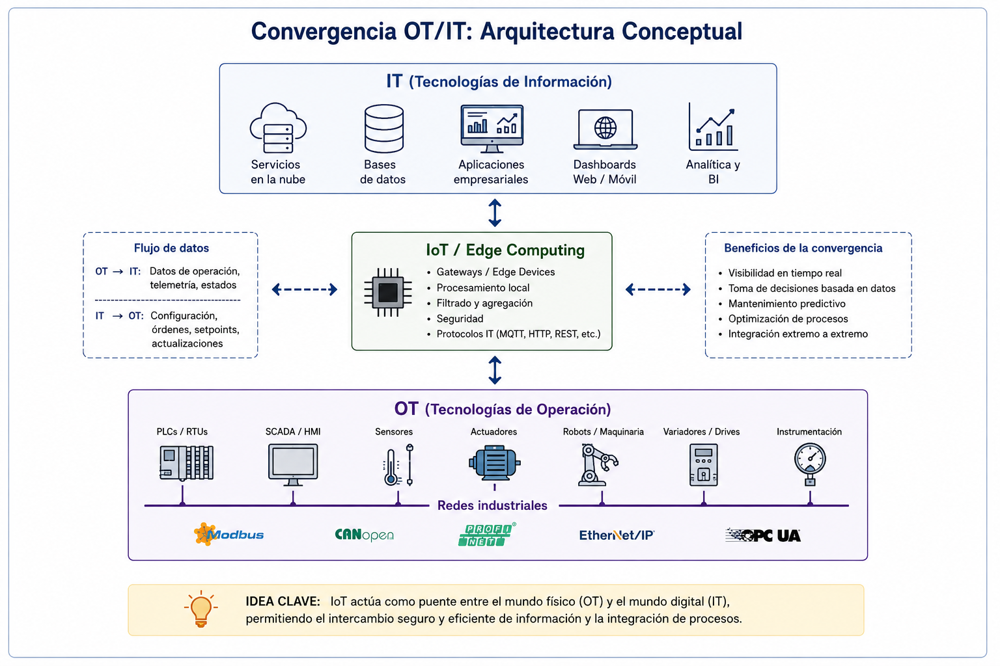{ width="600px" style="display:block;margin:auto" }

###### Ejemplos
* Un PLC que publica información mediante MQTT.
* Un sistema SCADA conectado a una base de datos en la nube.
* Un sistema de monitoreo energético con dashboard web.
* Una línea de producción cuyos indicadores se visualizan en tiempo real mediante una aplicación web.

==IoT actúa como puente entre el mundo físico (OT) y el mundo digital (IT).==

##### 1.1.5 Edge Computing

Conforme aumentó la cantidad de dispositivos IoT, surgió la necesidad de procesar parte de la información cerca de donde ésta se genera.

Satyanarayanan define Edge Computing como un modelo donde el procesamiento se desplaza desde la nube hacia los dispositivos cercanos al origen de los datos.

###### Características

* Menor latencia.
* Menor tráfico hacia la nube.
* Respuesta más rápida.
* Mayor autonomía.

###### Arquitectura típica

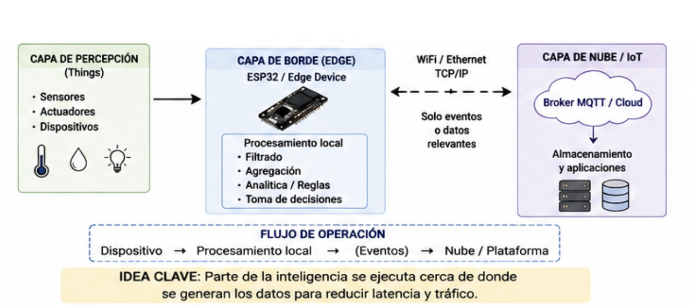{ width="600px" style="display:block;margin:auto" }

==No todo procesamiento debe realizarse en la nube; parte de la inteligencia puede ejecutarse cerca de donde se generan los datos.==

##### 1.1.6 Edge Intelligence

En las primeras aplicaciones IoT, los dispositivos se limitaban a adquirir datos y enviarlos hacia servidores remotos o plataformas en la nube para su procesamiento.

Sin embargo, conforme aumentó el número de dispositivos conectados, surgieron limitaciones relacionadas con la latencia, el ancho de banda, la disponibilidad de la red y la necesidad de respuestas en tiempo real.

Como consecuencia, los dispositivos comenzaron a incorporar capacidades de procesamiento local, dando origen al concepto de Edge Intelligence.

La Edge Intelligence consiste en ejecutar algoritmos de análisis y toma de decisiones directamente en el dispositivo o cerca de la fuente de datos, reduciendo la dependencia de servicios remotos.

###### Capacidades típicas

* Filtrado de datos.
* Detección de eventos.
* Clasificación de estados.
* Toma de decisiones locales.
* Ejecución de reglas de negocio.
* Inferencia mediante modelos ligeros de IA.

###### Arquitectura conceptual
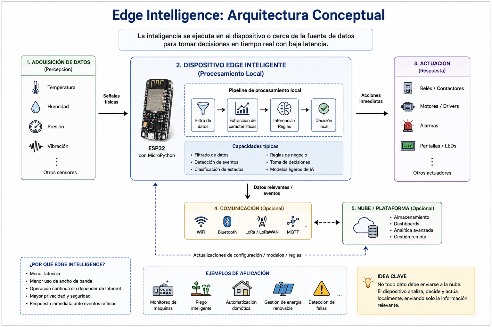{ width="600px" style="display:block;margin:auto" }

###### Ejemplos
* Encender un ventilador sin consultar la nube.
* Detectar una condición de alarma localmente.
* Clasificar el estado de una máquina.
* Ajustar automáticamente una variable de proceso.

###### Relación con MicroPython
MicroPython permite implementar fácilmente lógica de decisión directamente sobre dispositivos como ESP32, facilitando el desarrollo de aplicaciones Edge sin necesidad de infraestructura compleja.

==No todo dato debe enviarse a la nube; muchas decisiones pueden tomarse directamente en el borde de la red.==

##### 1.1.7 Sistemas Ciberfísicos (CPS)

Edward Lee define un CPS como la integración estrecha entre:

* Computación.
* Comunicación.
* Procesos físicos.

mediante ciclos continuos de monitoreo y actuación.

###### Ejemplos

* Vehículos autónomos.
* Robots colaborativos.
* Sistemas de riego inteligente.
* Redes eléctricas inteligentes.
* Manufactura avanzada.

###### Arquitectura típica

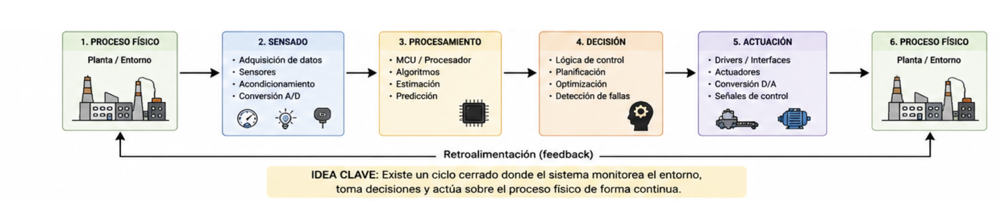{ width="900px" style="display:block;margin:auto" }

Los Sistemas Ciberfísicos representan la convergencia entre computación, comunicación y procesos físicos, permitiendo que los dispositivos monitoreen el entorno, tomen decisiones y actúen sobre él en ciclos continuos de retroalimentación.

==Los CPS constituyen uno de los pilares tecnológicos de la Industria 4.0 y de muchas aplicaciones IoT modernas.==

##### 1.1.8 Arquitecturas distribuidas
Los sistemas embebidos tradicionales concentraban toda la funcionalidad en un único controlador responsable de adquirir datos, procesarlos y actuar sobre el entorno.

Sin embargo, conforme aumentó la complejidad de las aplicaciones, surgió la necesidad de distribuir las tareas entre múltiples dispositivos especializados.

Una **arquitectura distribuida** es aquella en la que varias unidades de procesamiento colaboran para alcanzar un objetivo común mediante el intercambio de información.

Cada nodo puede asumir responsabilidades específicas relacionadas con sensado, procesamiento, comunicación o actuación.

###### Características

* Distribución de responsabilidades.
* Escalabilidad.
* Tolerancia a fallos.
* Modularidad.
* Interoperabilidad.

###### Ejemplos

* Redes de sensores inalámbricos.
* Sistemas domóticos.
* Vehículos modernos con múltiples ECUs.
* Robots colaborativos.
* Sistemas de monitoreo industrial.
* Micro-redes energéticas inteligentes.

###### Arquitectura conceptual

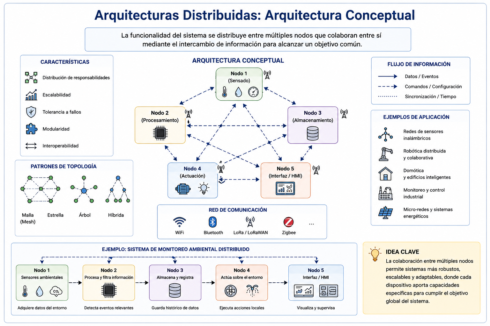{ width="600px" style="display:block;margin:auto" }

Las arquitecturas distribuidas constituyen la base de muchas soluciones IoT modernas y de los Sistemas Ciberfísicos, donde múltiples dispositivos cooperan para monitorear, controlar y optimizar procesos físicos.

==La inteligencia ya no reside en un único controlador; se distribuye entre múltiples dispositivos capaces de colaborar entre sí.==

##### 1.1.9 Relación entre conceptos
La evolución puede representarse de la siguiente manera:

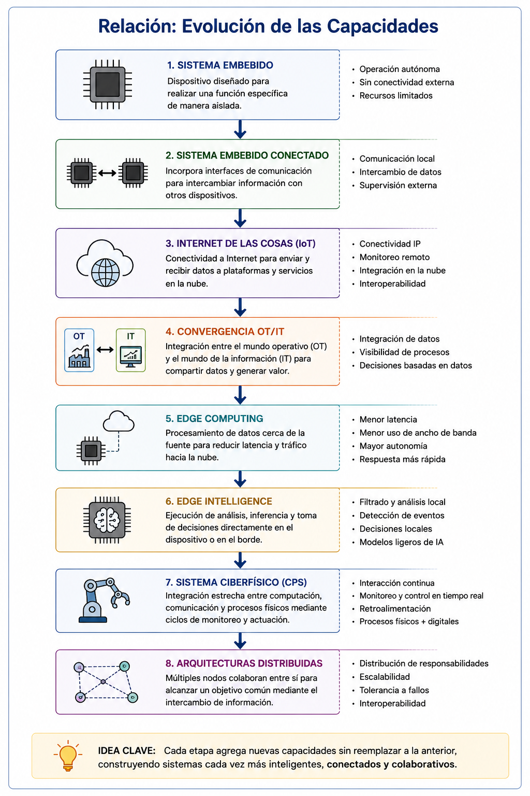{ width="600px" style="display:block;margin:auto" }

Cada etapa incorpora nuevas capacidades sin reemplazar completamente a la anterior.

##### 1.1.1 10 Discusión

¿Qué diferencia existe entre un sistema embebido tradicional y un dispositivo IoT?

| Característica | Sistema Embebido Tradicional | Dispositivo IoT |
|--------------- |------------------------------|-----------------|
| Función principal | Ejecutar una tarea específica | Ejecutar una tarea específica y compartir información |
| Conectividad | Generalmente inexistente o local | Conectividad mediante Internet |
| Acceso a la información | Local | Local y remoto |
| Intercambio de datos | Limitado | Continuo y distribuido |
| Monitoreo remoto | No disponible | Disponible |
| Integración con otros sistemas | Limitada | Alta |
| Actualización de información | Local | En tiempo real o bajo demanda |
| Ejemplos | Microondas, lavadora, ABS automotriz | Sensor ambiental, medidor inteligente, estación meteorológica IoT |
| Dependencia de Internet | No | Generalmente sí |
| Arquitectura típica | Sensor → Controlador → Actuador | Sensor → ESP32 → Red → Plataforma IoT |

Si un PLC industrial incorpora conectividad Ethernet, publica información mediante MQTT y permite monitoreo remoto a través de una plataforma web, ¿sigue siendo únicamente un sistema embebido o puede considerarse también un dispositivo IoT?

Analice la respuesta considerando los conceptos revisados previamente.

Finalmente:
* ==¿Qué plataforma me permite construir este tipo de sistemas de forma rápida y sencilla?==

### 2. MicroPython y plataformas ESP32/STM32

#### 2.1 El desafío del desarrollo embebido moderno
Los sistemas embebidos actuales ya no se limitan a ejecutar una única función de control local.

Es común encontrar dispositivos capaces de:

* Adquirir datos de múltiples sensores.
* Comunicarse mediante diferentes protocolos.
* Interactuar con plataformas IoT.
* Ejecutar procesamiento local.
* Participar en arquitecturas distribuidas.

Como consecuencia, el desarrollo de software embebido se ha vuelto cada vez más complejo.

Tradicionalmente estas aplicaciones se han implementado utilizando lenguajes compilados como C y C++, los cuales ofrecen un alto desempeño pero también incrementan el tiempo de desarrollo, depuración y mantenimiento.

¿Qué es más costoso actualmente?

* El hardware.
* El software.

Hace veinte años el hardware era la principal limitante Actualmente, en muchos proyectos, el tiempo de desarrollo del software representa el mayor costo.

#### 2.2 ¿Qué es MicroPython?

MicroPython es una implementación ligera y eficiente del lenguaje Python 3 diseñada para ejecutarse sobre microcontroladores y sistemas con recursos limitados.

Fue desarrollado por Damien George con el objetivo de llevar la productividad y simplicidad de Python al desarrollo de sistemas embebidos.

##### Características principales

* Sintaxis basada en Python 3.
* Interpretado.
* Interactivo.
* Multiplataforma.
* Extensible mediante módulos.

##### Filosofía de desarrollo

MicroPython fue diseñado para favorecer:
* Desarrollo rápido
    * Reducir tiempos de implementación.
* Prototipado
    * Construir soluciones funcionales rápidamente.
* Experimentación
    * Facilitar pruebas y validaciones.
* Integración IoT
    * Permitir la implementación sencilla de aplicaciones conectadas.

#### 2.3 ¿Por qué MicroPython?

##### Comparación con Arduino

| Característica | Arduino (C/C++) | MicroPython |
|----------------|-----------------|-------------|
| Lenguaje principal | C/C++ | Python 3 (MicroPython) |
| Curva de aprendizaje | Media | Baja |
| Tiempo de desarrollo | Medio | Bajo |
| Compilación previa | Requerida | No requerida |
| REPL (ejecución interactiva) | No | Sí |
| Prototipado rápido | Medio | Alto |
| Depuración interactiva | Limitada | Alta |
| Legibilidad del código | Media | Alta |
| Cantidad de código requerida | Mayor | Menor |
| Productividad del desarrollador | Media | Alta |
| Consumo de memoria | Bajo | Medio-Alto |
| Velocidad de ejecución | Alta | Media |
| Control de recursos hardware | Alto | Medio |
| Aplicaciones de tiempo real estricto | Adecuado | Limitado |
| Integración con protocolos IoT | Media | Alta |
| Desarrollo de pruebas y conceptos (PoC) | Medio | Alto |
| Portabilidad entre plataformas | Media | Alta |
| Ecosistema educativo | Muy amplio | Amplio |
| Ecosistema IoT | Amplio | Muy amplio |

**MicroPython no busca reemplazar a C/C++**: Ambos enfoques son complementarios. MicroPython destaca en aplicaciones de prototipado rápido, IoT, Edge Computing y sistemas conectados, mientras que C/C++ continúa siendo la opción preferida para aplicaciones con restricciones estrictas de memoria, desempeño o tiempo real.

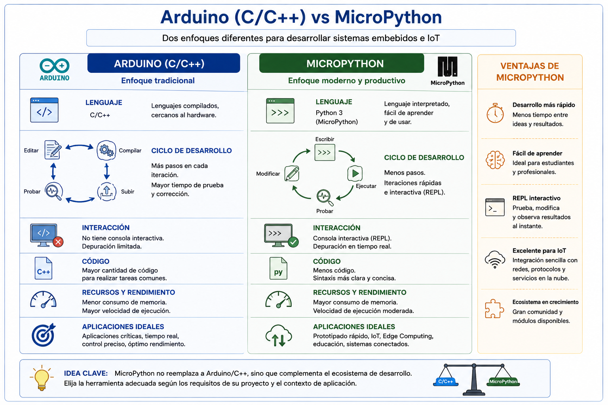{ width="600px" style="display:block;margin:auto" }

##### Ventajas

* Menor cantidad de código
* Desarrollo interactivo
* Curva de aprendizaje reducida
* Integración sencilla con IoT
* Mayor productividad

##### Limitaciones

* Mayor consumo de memoria
* Menor desempeño
* No orientado a tiempo real estricto
* Menor control sobre recursos internos

==¿Cuándo NO utilizar MicroPython?==

Ejemplos:
* Control de movimiento de alta precisión.
* Sistemas críticos de seguridad.
* Aplicaciones con restricciones temporales estrictas.

#### 2.4 Arquitectura de MicroPython

##### Componentes principales:
* Firmware: software residente en el microcontrolador.
* Máquina virtual: ejecuta instrucciones Python.
* Bytecode: representación intermedia del programa
* Heap: memoria dinámica utilizada por objetos.
* Garbage collectos: mecanismo automático de liberación de memoria.

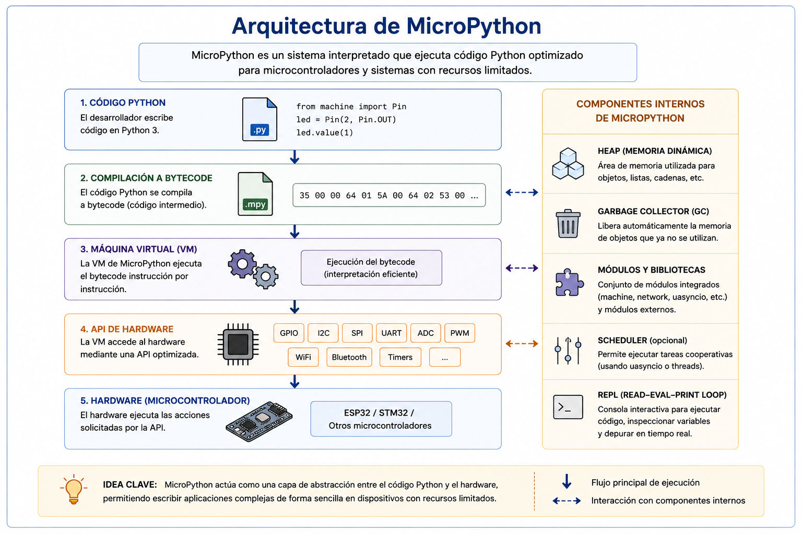{ width="600px" style="display:block;margin:auto" }

##### Implicaciones para el desarrollador
* Memoria: uso del heap.
* Rendimiento: código interpretado.
* Portabilidad: el mismo programa puede ejecutarse en distintas plataformas

¿Por qué MicroPython consume más memoria que un programa equivalente escrito en C?

#### 2.5 Plataformas ESP32 y STM32

##### ESP32

###### Características principales:
* Procesador Dual-Core.
* WiFi integrado.
* Bluetooth integrado.
* ADC.
* PWM.
* UART.
* SPI.
* I2C.

###### ¿Por qué es tan popular en IoT?
Porque integra:
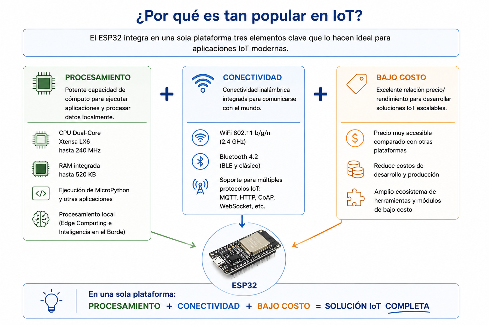{ width="600px" style="display:block;margin:auto" }
en una sola plataforma.

###### Casos de aplicación
* Domótica.
* Agricultura inteligente.
* Monitoreo remoto.
* Sistemas energéticos.
* Industria 4.0.

Arquitectura Interna del ESP32
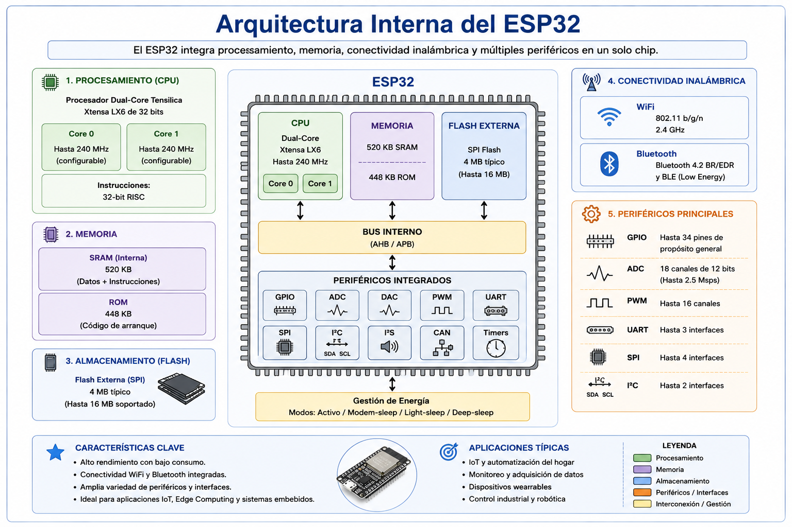{ width="600px" style="display:block;margin:auto" }

##### STM32

Características generales
* Familia de microcontroladores desarrollada por STMicroelectronics ampliamente utilizada en aplicaciones industriales.

###### Fortalezas
* Bajo consumo energético.
* Gran variedad de periféricos.
* Amplia adopción industrial.
* Elevado desempeño.

###### Aplicaciones
* Automatización industrial.
* Instrumentación.
* Electrónica médica.
* Automotriz.

###### ESP32 vs STM32
| Característica | ESP32 | STM32 |
|----------------|--------|--------|
| Fabricante | Espressif Systems | STMicroelectronics |
| Arquitectura | Xtensa LX6 / LX7 (según modelo) | ARM Cortex-M (M0, M3, M4, M7, M33, etc.) |
| Frecuencia de CPU | Hasta 240 MHz (ESP32 clásico) | Desde algunos MHz hasta más de 500 MHz según familia |
| Núcleos | Dual-Core (en muchos modelos) | Generalmente Single-Core (algunas familias incluyen múltiples núcleos) |
| Memoria RAM | ~520 KB SRAM (ESP32 clásico) | Variable según modelo (desde KB hasta varios MB) |
| Memoria Flash | Externa SPI Flash | Interna y/o externa según modelo |
| WiFi integrado | Sí | Generalmente no |
| Bluetooth integrado | Sí (BLE y Clásico) | Depende del modelo |
| GPIO | Amplia disponibilidad | Amplia disponibilidad |
| ADC | Integrado | Integrado |
| PWM | Integrado | Integrado |
| UART | Integrado | Integrado |
| SPI | Integrado | Integrado |
| I²C | Integrado | Integrado |
| CAN Bus | Disponible en algunos modelos | Amplio soporte en familias industriales |
| Consumo energético | Medio | Bajo a muy bajo según familia |
| Ecosistema IoT | Muy amplio | Medio |
| Ecosistema industrial | Medio | Muy amplio |
| Facilidad para proyectos IoT | Alta | Media |
| Facilidad para conectividad inalámbrica | Alta | Requiere módulos adicionales en muchos casos |
| Soporte MicroPython | Excelente | Excelente |
| Soporte Arduino | Excelente | Excelente |
| Costo | Bajo | Variable |
| Curva de aprendizaje | Baja | Media |
| Aplicaciones típicas | IoT, domótica, monitoreo remoto, Edge Computing | Automatización industrial, instrumentación, control embebido, automotriz, dispositivos médicos |

ESP32 destaca por integrar conectividad inalámbrica y facilitar el desarrollo de aplicaciones IoT, mientras que STM32 sobresale por su amplia adopción industrial, diversidad de familias y capacidades para sistemas embebidos de alto desempeño y bajo consumo.

| Pregunta | ESP32 | STM32 |
|-----------|--------|--------|
| ¿Cuál elegir para desarrollar un sistema IoT? |  Muy recomendable por integrar WiFi y Bluetooth | Posible, pero normalmente requiere hardware adicional |
| ¿Cuál elegir para un sistema industrial de control? | Adecuado para prototipos y aplicaciones no críticas | Muy utilizado en entornos industriales |
| ¿Cuál elegir para prototipado rápido con MicroPython? |  Excelente opción | Muy buena opción |
| ¿Cuál elegir para aplicaciones de muy bajo consumo? | Bueno |  Generalmente mejor |

#### 2.6 Conclusión
La creciente complejidad de los sistemas embebidos modernos ha impulsado la adopción de herramientas que permitan reducir el tiempo de desarrollo sin sacrificar capacidades de conectividad e integración. En este contexto, MicroPython representa una alternativa atractiva para el desarrollo de aplicaciones IoT y Edge Computing sobre plataformas como ESP32 y STM32, proporcionando un entorno flexible, interactivo y orientado al prototipado rápido.

### 3. Configuración del Entorno y REPL

El desarrollo de aplicaciones embebidas con MicroPython requiere la preparación de un entorno de trabajo que permita programar, depurar e interactuar con el hardware de manera eficiente. En esta sección se abordará la instalación y configuración de las herramientas necesarias para trabajar con ESP32 y MicroPython, así como el uso del **REPL (Read-Eval-Print Loop)**, una de las características más importantes de MicroPython.

A diferencia de otros entornos de desarrollo para sistemas embebidos, el REPL permite ejecutar instrucciones de manera interactiva y obtener resultados inmediatos, facilitando la exploración del hardware, la validación de ideas y el desarrollo rápido de prototipos.

Las siguientes prácticas tienen como objetivo familiarizar al participante con el entorno de desarrollo y con la forma de trabajo interactiva que caracteriza a MicroPython.

#### Práctica 1. Configuración del Entorno de Desarrollo ESP32 + MicroPython

Antes de desarrollar aplicaciones embebidas es necesario preparar el entorno de trabajo. En esta práctica se realizará la instalación y configuración de las herramientas requeridas para programar dispositivos ESP32 utilizando MicroPython.

Al finalizar, el participante será capaz de instalar el firmware MicroPython en una tarjeta ESP32, configurar el entorno Thonny y ejecutar un primer programa de prueba para verificar el correcto funcionamiento del sistema.

##### Competencias desarrolladas

* Instalar y configurar el entorno de desarrollo MicroPython.
* Identificar y configurar el puerto de comunicación de la ESP32.
* Flashear firmware MicroPython sobre una plataforma ESP32.
* Configurar Thonny para el desarrollo de aplicaciones embebidas.
* Ejecutar un primer programa de prueba.

##### Material de apoyo

📄 [Abrir o descargar la práctica en PDF](Practica1_ESP32_MicroPython.pdf)

<iframe
    src="Practica1_ESP32_MicroPython.pdf"
    width="100%"
    height="800px">
</iframe>