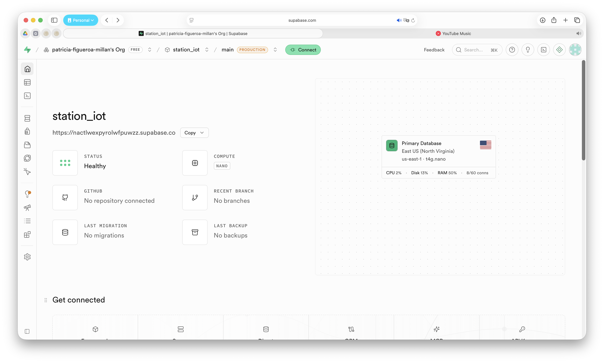
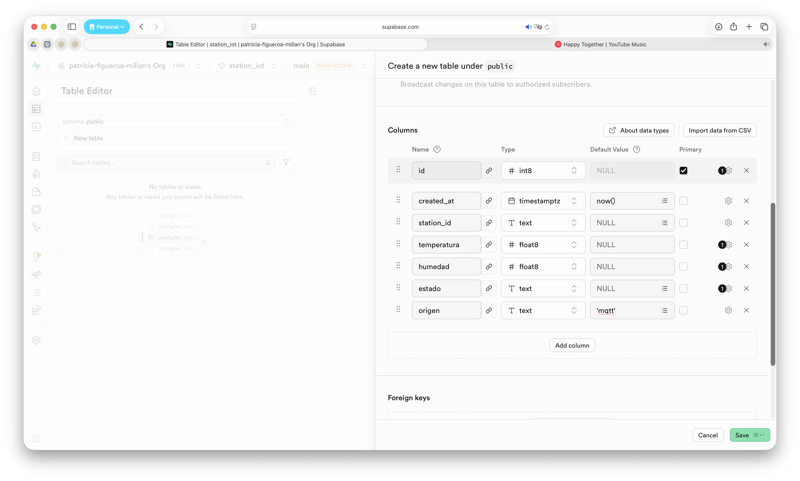
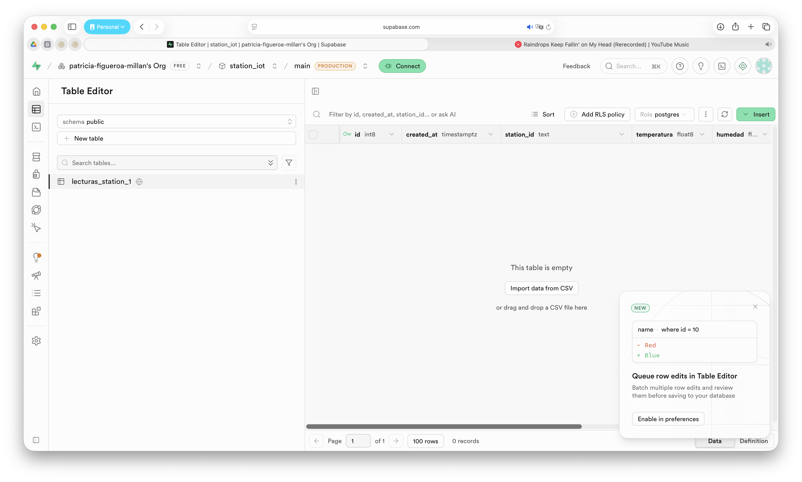

# Base de Datos en Supabase para Proyectos IoT

## Introducción

Hasta este punto del proyecto, las estaciones ambientales han sido capaces de medir variables físicas, visualizarlas localmente y transmitirlas mediante MQTT. Sin embargo, para construir aplicaciones IoT reales es necesario almacenar la información de manera permanente para posteriormente consultarla, analizarla, generar reportes o visualizar históricos.

En esta práctica se utilizará **Supabase**, una plataforma Backend as a Service (BaaS) basada en PostgreSQL que proporciona una base de datos relacional, autenticación y una API REST automática para acceder a la información.

Al finalizar la práctica se contará con una base de datos en la nube lista para recibir las mediciones provenientes de las estaciones ambientales.

---

# Objetivo

Crear un proyecto en Supabase y una tabla para almacenar las variables ambientales generadas por las estaciones IoT.

---

# Competencias a desarrollar

- Crear proyectos en Supabase.
- Comprender la estructura de una base de datos PostgreSQL.
- Diseñar una tabla para almacenar datos IoT.
- Utilizar el editor SQL de Supabase.
- Preparar una base de datos para recibir información desde aplicaciones externas.

---

# Material requerido

- Computadora con acceso a Internet.
- Navegador web.
- Cuenta de correo electrónico.
- Proyecto del taller desarrollado hasta la sesión anterior.

---

# Desarrollo

## Paso 1. Crear una cuenta en Supabase

1. Abrir el navegador.
2. Entrar al sitio:

```text
https://supabase.com
```

3. Hacer clic en **Start your project**.
4. Registrarse utilizando:
   - GitHub, o
   - una cuenta de correo electrónico.
5. Confirmar el correo electrónico (si es necesario).
6. Iniciar sesión.

Después de iniciar sesión, Supabase mostrará la pantalla **Your Organizations**, donde se listan las organizaciones asociadas a la cuenta.

Si es la primera vez que utiliza Supabase, 
no aparece ninguna organización, haga clic en **New organization**, asigne un nombre y créela antes de continuar siguiendo las instrucciones de Supabase.

Si no es la primera vez que utiliza Supabase probablemente solo aparecerá la organización que se haya creado en su momento. Si es así, seleccione su organización haciendo clic sobre ella.

Una vez dentro de la organización, se mostrará el panel de proyectos desde donde será posible crear un nuevo proyecto.

Al ingresar se mostrará el panel principal de Supabase.

---

## Paso 2. Crear un nuevo proyecto

Seleccionar:

```text
New Project
```

Completar la siguiente información:

| Campo | Valor sugerido |
|--------|----------------|
| Organization | La organización creada y seleccionada previamente. |
| Project Name | `station_iot_X`, donde **X** corresponde al número asignado a la estación (por ejemplo: `station_iot_01`). |
| Database Password | Una contraseña segura que recuerde posteriormente (por ejemplo: `#So11fi26a17`). |
| Region | **Americas** (o la región más cercana disponible). |
| Pricing Plan | Free |

En la sección **Security**, dejar habilitadas las siguientes opciones:

- ☑ **Enable Data API**
- ☑ **Automatically expose new tables**
- ☑ **Enable automatic RLS**

### ¿Por qué habilitar estas opciones?

**Enable Data API**

Esta opción habilita automáticamente la API REST de Supabase para la base de datos. Gracias a ello, las aplicaciones externas podrán insertar, consultar, actualizar o eliminar información mediante solicitudes HTTP, sin necesidad de desarrollar una API propia.

**Automatically expose new tables**

Permite que las nuevas tablas creadas en el esquema **public** queden disponibles automáticamente a través de la Data API. Esto simplifica el desarrollo de la práctica, ya que las tablas podrán ser utilizadas inmediatamente por las aplicaciones que enviarán o consultarán información.

> **Nota:** En proyectos de producción normalmente se recomienda administrar manualmente qué tablas estarán disponibles mediante la API para tener un mayor control sobre la seguridad.

**Enable automatic RLS**

RLS (*Row Level Security*) es un mecanismo de seguridad de PostgreSQL que controla qué registros puede consultar o modificar cada usuario.

Al habilitar esta opción, todas las tablas nuevas creadas en el proyecto tendrán activada automáticamente esta capa de seguridad, siguiendo las buenas prácticas recomendadas por Supabase. Más adelante se configurarán las políticas necesarias para permitir el acceso a la información de forma controlada.

Finalmente seleccionar:

```text
Create New Project
```

Esperar algunos minutos mientras Supabase crea la base de datos. Le mostrará algo similar a la siguiente pantalla

{ width="600px" style="display:block;margin:auto" }

---

## Paso 3. Crear una tabla

Una vez creado el proyecto, dirigirse al menu lateral izquierdo y seleccionar:

```text
Table Editor
```

Le mostrará la opción de:

```text
Create a new table
```

Configurar:

| Campo | Valor |
|--------|-------|
| Schema | public |
| Table Name | lecturas_station_X|

Recuerde que la "X", es el numero de id de su estación.

Dejar habilitada la opción:

```text
Enable Row Level Security (RLS)
```

### Enable Realtime

La opción **Enable Realtime** permite que Supabase envíe automáticamente a las aplicaciones los cambios realizados en una tabla (inserciones, modificaciones o eliminaciones) mediante conexiones WebSocket, sin necesidad de realizar consultas periódicas a la base de datos.

Para el desarrollo de este proyecto **no es necesario habilitar esta opción**, ya que la base de datos se utilizará únicamente para almacenar las mediciones enviadas por las estaciones IoT. Posteriormente, la aplicación móvil consultará la información mediante la API REST de Supabase cuando sea necesario.

Por lo tanto, se recomienda dejar esta opción desactivada.

```text
☐ Enable Realtime
```

> **Nota:** La funcionalidad **Realtime** resulta útil cuando se desea que una aplicación reciba automáticamente las nuevas mediciones en el momento en que son almacenadas en la base de datos. Aunque esta característica no será utilizada en el presente taller, puede incorporarse en proyectos futuros que requieran monitoreo en tiempo real.

---

## Paso 4. Agregar las columnas

Crear los siguientes campos.

| Columna | Tipo de dato | Configuración |
|----------|--------------|---------------|
| id | int8 | Primary Key + Identity |
| created_at | timestamptz | Default: now() |
| station_id[^1] | text | NOT NULL |
| temperatura | float8 | |
| humedad | float8 | |
| estado | text | |
| origen[^2] | text | Default: `'mqtt'` |

La estructura de la tabla será similar a la siguiente:

| id | created_at | station_id | temperatura | humedad | estado | origen |
|----|------------|------------|--------------|----------|---------|---------|

[^1]: Después de crear la columna **`station_id`**, haga clic en **Opciones adicionales (⚙️)** y desmarque **Is Nullable**.
[^2]: Para la columna **`origen`**, haga clic en el ícono de **Opciones adicionales (⚙️)** y desmarque la opción **Is Nullable**. Posteriormente, en el campo **Default Value**, escriba **`'mqtt'`**. De esta manera, todos los registros almacenarán automáticamente el valor **`mqtt`**, identificando que la información fue recibida a través del servicio MQTT.

Deberá quedarle algo como se muestra en la pantalla siguiente:

{ width="600px" style="display:block;margin:auto" }


> **Nota:** La tabla **`lecturas_ambientales`** está diseñada para almacenar únicamente el historial de mediciones generadas por las estaciones IoT. Por esta razón, solo se incluyen los datos necesarios para identificar la estación, registrar el momento de la medición y almacenar las variables ambientales junto con el estado calculado.

> Los parámetros de configuración de cada estación, como la temperatura máxima (`temp_max`), la humedad mínima (`hum_min`), la humedad máxima (`hum_max`) o el intervalo de lectura (`intervalo_lectura`), **no se almacenan en esta tabla**, ya que forman parte de la configuración local del nodo y no representan datos históricos.

> En aplicaciones IoT de mayor complejidad, estos parámetros podrían almacenarse en una tabla independiente de configuración, permitiendo modificarlos remotamente desde una aplicación. Sin embargo, para el desarrollo de este proyecto, dichos valores permanecerán configurados directamente en el programa de cada estación.

Una vez configuradas todas las columnas y sus propiedades, haga clic en:

```text
Save
```

Supabase creará la tabla **`lecturas_ambientales`** (o el nombre que haya definido para su estación) dentro de la base de datos PostgreSQL del proyecto.

Al finalizar, la tabla aparecerá en el **Table Editor**, quedando lista para almacenar las mediciones generadas por la estación IoT, como se muestra a continuación:

{ width="600px" style="display:block;margin:auto" }

---


## Paso 5. Obtener las credenciales del proyecto

Una vez creada la tabla, en el menú lateral seleccione:

```text
Settings → API Keys
```

En esta sección se muestran las credenciales necesarias para acceder a la base de datos desde aplicaciones externas.
### Obtener la URL de la API

En el menú lateral seleccione:

```text

Settings → Data API

```

Copie la siguiente información:

- **API URL**

Esta dirección corresponde al punto de acceso de la API REST de Supabase y será utilizada por el servicio desarrollado en MicroPython para insertar las mediciones en la base de datos.

> **Nota:** Posteriormente se agregará a esta dirección el nombre de la tabla para construir el endpoint completo que utilizará el servicio en Python.
---
## Resultado esperado

Al finalizar la práctica se deberá contar con:

- Una cuenta en Supabase.
- Un proyecto creado.
- Una base de datos PostgreSQL.
- Una tabla para almacenar las mediciones ambientales.
- La API URL del proyecto.
- La Secret key del proyecto.

La base de datos quedará lista para recibir las mediciones generadas por la estación IoT en la siguiente práctica, donde se desarrollará el servicio en Python encargado de almacenar automáticamente la información proveniente del broker MQTT.

---
# Resultado esperado

Al finalizar la práctica se deberá contar con:

- Una cuenta en Supabase.
- Un proyecto creado.
- Una base de datos PostgreSQL.
- Una tabla para almacenar las mediciones ambientales.
- La API URL del proyecto identificada.
- La Secret key del proyecto identificada.
- Una base de datos lista para recibir automáticamente las mediciones generadas por las estaciones IoT.

> **Nota:** En este proyecto no se insertarán datos directamente desde la ESP32 hacia Supabase. La estación IoT publicará sus mediciones mediante MQTT y una aplicación desarrollada en Streamlit actuará como cliente suscriptor.
>
> La aplicación Streamlit recibirá los mensajes publicados por las estaciones, los mostrará en un panel web y también los insertará en Supabase para generar el historial de mediciones.
>
> La arquitectura utilizada será:
>
> ```text
> ESP32 → MQTT → Streamlit → Supabase
> ```
>
> De esta forma, la ESP32 se mantiene como un nodo IoT ligero, mientras que la aplicación Streamlit concentra la visualización de las mediciones y el almacenamiento histórico en la base de datos.

---

# Conclusiones

En esta práctica se configuró una base de datos en la nube utilizando Supabase. Esta infraestructura permitirá almacenar de forma permanente las mediciones generadas por las estaciones ambientales y servirá como repositorio para el historial de datos del proyecto.

En la siguiente práctica se desarrollará una aplicación en Streamlit que actuará como cliente suscriptor del broker MQTT. Esta aplicación recibirá las mediciones publicadas por las estaciones IoT, las mostrará en un panel web y las almacenará automáticamente en Supabase, integrando así el flujo completo de adquisición, visualización y almacenamiento de datos.